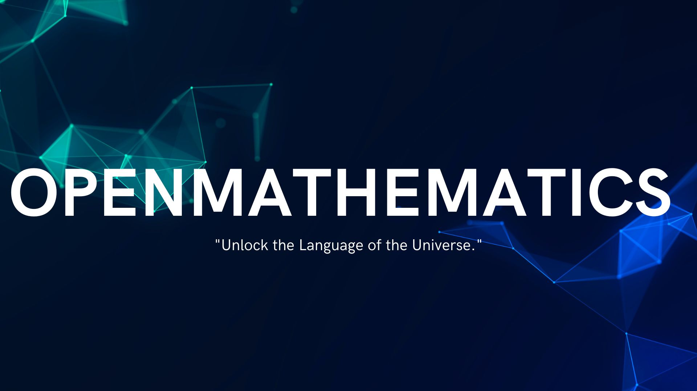

<h3>OpenMathematics</h3>

  Empowering the next generation of mathematicians open to all, free for all.

  

# Contents

- [Summary](#summary)
- [Prerequisites](#prerequisites)

# Summary

OpenMathematics is an open-source curriculum designed to document and share the self-taught journey of mastering Computer Science, Mathematics, and Physics at a level equivalent to a **full bachelor's degree** in these fields. This curriculum is inspired by the structure and rigor of [OSSU (Open Source Society University)](https://github.com/ossu) in [CS](https://github.com/ossu/computer-science) and [Mathematics](https://github.com/ossu/math), with an additional focus on Physics to create a holistic foundation for advanced studies and research.

## What is OpenMathematics?

OpenMathematics is a living Project (repository) of NovaVerseOrg that evolves with its creator's learning journey. As each course, topic, or resource is completed, it is added to the repository, along with detailed notes, insights, and recommendations. The goal is to:

1. **Guide learners** : Provide a roadmap for others seeking a similar path.
2. **Curate resources** : Share only the most valuable and effective resources for learning.
3. **Build expertise** : Equip learners with skills equivalent to a bachelor’s degree in the three disciplines.

## Why OpenMathematics?

1. **Multidisciplinary Focus** : Combines Mathematics into a unified curriculum, preparing learners, AI, and scientific research.
2. **Real-World Relevance** : The curriculum emphasizes practical and theoretical knowledge, blending applied skills with rigorous academic foundations.
3. **Open and Adaptive** : Unlike static curriculums, OpenMathematics grows organically as its creator progresses, ensuring that it always reflects up-to-date and firsthand experiences.

## Key Features of OpenMathematics

1. **Dynamic Learning** : Resources are added only after they have been tested and completed by the creator, ensuring high-quality recommendations.
2. **Comprehensive Coverage** : Aims to match the depth and breadth of a bachelor's degree in Mathematics.
3. **Resource Recommendations** : Links to free, open-source, and paid resources (if essential) that helped shape the creator's understanding.

## How to Use OpenMathematics

1. **Follow the Curriculum** : Start with the basics and work through intermediate and advanced topics.
2. **Leverage the Resources** : Use the curated materials and notes to enhance your learning.
3. **Tackle Projects** : Apply your knowledge in real-world scenarios to solidify your understanding.

## Who is OpenMathematics For?

- **Self-Taught Learners** : Anyone seeking a structured and comprehensive path to mastering Mathematics.
- **Aspiring Researchers**: Those aiming to specialize in areas like advanced Mathematics and Aspiring Researchers.
- **Professionals** : Individuals looking to deepen their knowledge or pivot into technical fields.

## Conclusion

OpenMathematics is not just a curriculum; it’s a testament to the power of self-learning and the open-source spirit. By following this roadmap, learners can gain an equivalent level of expertise to a **full bachelor's degree in Mathematics.** As the journey unfolds, OpenMathematics will continue to evolve, empowering others to achieve their educational goals.
